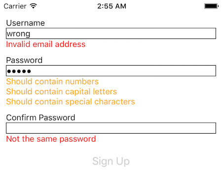
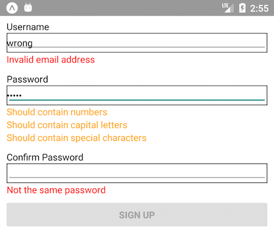

# react-form-with-constraints

[](https://badge.fury.io/js/react-form-with-constraints)
[](https://travis-ci.org/tkrotoff/react-form-with-constraints)
[](https://codecov.io/gh/tkrotoff/react-form-with-constraints)
[](https://unpkg.com/react-form-with-constraints/dist/react-form-with-constraints.production.min.js.gz)

Simple form validation for React

- Installation: `npm install react-form-with-constraints`
- CDN: https://unpkg.com/react-form-with-constraints/dist/

Check the [changelog](CHANGELOG.md) for breaking changes and fixes between releases.

## Introduction: what is HTML5 form validation?

⚠️ [Client side validation is cosmetic, you should not rely on it to enforce security](https://stackoverflow.com/q/162159)

```HTML
<form>
  <label for="email">Email:</label>
  <input type="email" id="email" required>
  <button>Submit</button>
</form>
```


The `required` HTML5 attribute specifies that the user must fill in a value, [`type="email"`](https://developer.mozilla.org/en-US/docs/Web/HTML/Element/input/email) checks that the entered text looks like an email address.

Resources:
- [Making Forms Fabulous with HTML5](https://www.html5rocks.com/en/tutorials/forms/html5forms/)
- [Constraint Validation: Native Client Side Validation for Web Forms](https://www.html5rocks.com/en/tutorials/forms/constraintvalidation/)
- [MDN - Form data validation](https://developer.mozilla.org/en-US/docs/Learn/HTML/Forms/Form_validation)
- [MDN - Form input types](https://developer.mozilla.org/en-US/docs/Web/HTML/Element/input#Form_<input>_types)

## What react-form-with-constraints brings

- Minimal API and footprint
- Control HTML5 error messages: `<FieldFeedback when="valueMissing">My custom error message</FieldFeedback>`
- Custom constraints: `<FieldFeedback when={value => ...}>`
- Warnings and infos: `<FieldFeedback ... warning>`, `<FieldFeedback ... info>`
- Async validation
- No dependency beside React (no Redux, MobX...)
- No special field component, just plain old `<input>` or whatever you like
- Re-render only what's necessary
- Easily extendable
- Support for [React Native](examples/ReactNative) with npm package `react-form-with-constraints-native`
- [Bootstrap 4](examples/Bootstrap4) styling with npm package `react-form-with-constraints-bootstrap4`
- [Material-UI](examples/MaterialUI) integration with npm package `react-form-with-constraints-material-ui`
- ...

```JSX
<input type="password" name="password"
       value={this.state.password} onChange={this.handleChange}
       required pattern=".{5,}" />
<FieldFeedbacks for="password">
  <FieldFeedback when="valueMissing" />
  <FieldFeedback when="patternMismatch">
    Should be at least 5 characters long
  </FieldFeedback>
  <FieldFeedback when={value => !/\d/.test(value)} warning>
    Should contain numbers
  </FieldFeedback>
  <FieldFeedback when={value => !/[a-z]/.test(value)} warning>
    Should contain small letters
  </FieldFeedback>
  <FieldFeedback when={value => !/[A-Z]/.test(value)} warning>
    Should contain capital letters
  </FieldFeedback>
</FieldFeedbacks>
```

## Examples

- CodePen basic example: https://codepen.io/tkrotoff/pen/BRGdqL

  

- CodeSandbox Bootstrap 4 example: https://codesandbox.io/s/qk0zro1qm4
- CodeSandbox Material-UI example: https://codesandbox.io/s/zx62rw4k64
- CodeSandbox WizardForm example: https://codesandbox.io/s/my0ojyzq6p
- CodeSandbox SignUp example: https://codesandbox.io/s/62qwozvm0k
- CodeSandbox ClubMembers example: https://codesandbox.io/s/q8364yn60j

- [React Native example](examples/ReactNative):

  | iOS                                                   |                                                       Android |
  | ----------------------------------------------------- | ------------------------------------------------------------- |
  |  |  |

Other examples inside [the examples directory](examples).

## How it works

The API works the same way as [React Router v4](https://reacttraining.com/react-router/web/example/basic):

```JSX
<Router>
  <Route exact path="/" component={Home} />
  <Route path="/news" component={NewsFeed} />
</Router>
```

It is also inspired by [AngularJS ngMessages](https://docs.angularjs.org/api/ngMessages#usage).

If you had to implement validation yourself, you would end up with [a global object that tracks errors for each field](examples/NoFramework/App.tsx).
react-form-with-constraints [works similarly](packages/react-form-with-constraints/src/FieldsStore.ts).
It uses [React context](https://github.com/reactjs/reactjs.org/blob/d59c4f9116138e419812e44b0fdb56644c498d3e/content/docs/context.md) to share the [`FieldsStore`](packages/react-form-with-constraints/src/FieldsStore.ts) object across [`FieldFeedbacks`](packages/react-form-with-constraints/src/FieldFeedbacks.tsx) and [`FieldFeedback`](packages/react-form-with-constraints/src/FieldFeedback.tsx).

## API

The API reads like this: "for field when constraint violation display feedback", example:
```JSX
<FieldFeedbacks for="password">
  <FieldFeedback when="valueMissing" />
  <FieldFeedback when="patternMismatch">Should be at least 5 characters long</FieldFeedback>
</FieldFeedbacks>
```
```
for field "password"
  when constraint violation "valueMissing"    display "the HTML5 error message (*)"
  when constraint violation "patternMismatch" display "Should be at least 5 characters long"
```

(*) [element.validationMessage](https://www.w3.org/TR/html51/sec-forms.html#the-constraint-validation-api)

Async support works as follow:
```JSX
<FieldFeedbacks for="username">
  <Async
    promise={checkUsernameAvailability} /* Function that returns a promise */
    then={available => available ?
      <FieldFeedback key="1" info style={{color: 'green'}}>Username available</FieldFeedback> :
      <FieldFeedback key="2">Username already taken, choose another</FieldFeedback>
      // Why key=*? Needed otherwise React gets buggy when the user rapidly changes the field
    }
  />
</FieldFeedbacks>
```

Trigger validation:
```JSX
class MyForm extends React.Component {
  async handleChange(e) {
    const target = e.currentTarget;

    // Validates only the given fields and returns Promise<Field[]>
    const fields = await this.form.validateFields(target);

    const fieldIsValid = fields.every(field => field.isValid());
    if (fieldIsValid) console.log(`Field '${target.name}' is valid`);
    else console.log(`Field '${target.name}' is invalid`);

    if (this.form.isValid()) console.log('The form is valid');
    else console.log('The form is invalid');
  }

  async handleSubmit(e) {
    e.preventDefault();

    // Validates the non-dirty fields and returns Promise<Field[]>
    const fields = await this.form.validateForm();

    // or simply this.form.isValid();
    const formIsValid = fields.every(field => field.isValid());

    if (formIsValid) console.log('The form is valid');
    else console.log('The form is invalid');
  }

  render() {
    return (
      <FormWithConstraints
        ref={formWithConstraints => this.form = formWithConstraints}
        onSubmit={this.handleSubmit} noValidate
      >
        <input
          name="username"
          onChange={this.handleChange}
          required minLength={3}
        />
        <FieldFeedbacks for="username">
          <FieldFeedback when="tooShort">Too short</FieldFeedback>
          <Async
            promise={checkUsernameAvailability}
            then={available => available ?
              <FieldFeedback key="1" info style={{color: 'green'}}>Username available</FieldFeedback> :
              <FieldFeedback key="2">Username already taken, choose another</FieldFeedback>
            }
          />
          <FieldFeedback when="*" />
        </FieldFeedbacks>
      </FormWithConstraints>
    );
  }
}
```

- [`FieldFeedbacks`](packages/react-form-with-constraints/src/FieldFeedbacks.tsx)
  - `for: string` => reference to a `name` attribute (e.g `<input name="username">`), should be unique to the current form
  - `stop?: 'first' | 'first-error' | 'first-warning' | 'first-info' | 'no'` =>
    when to stop rendering `FieldFeedback`s, by default stops at the first error encountered (`FieldFeedback`s order matters)

  Note: you can place `FieldFeedbacks` anywhere, have as many as you want for the same `field`, nest them, mix them with `FieldFeedback`... Example:

  ```JSX
  <input name="username" ... />

  <FieldFeedbacks for="username" stop="first-warning">
    <FieldFeedbacks>
      <FieldFeedback ... />
      <Async ... />
      <FieldFeedbacks stop="first-info">
        ...
      </FieldFeedbacks>
    </FieldFeedbacks>

    <FieldFeedback ... />
    <Async ... />
  </FieldFeedbacks>

  <FieldFeedbacks for="username" stop="no">
    ...
  </FieldFeedbacks>
  ```

- [`FieldFeedback`](packages/react-form-with-constraints/src/FieldFeedback.tsx)
  - `when?`:
    - [`ValidityState`](https://developer.mozilla.org/en-US/docs/Web/API/ValidityState) as a string => HTML5 constraint violation name
    - `'*'` => matches any HTML5 constraint violation
    - `'valid'` => displays the feedback only if the field is valid
    - `(value: string) => boolean` => custom constraint
  - `error?: boolean` => treats the feedback as an error (default)
  - `warning?: boolean` => treats the feedback as a warning
  - `info?: boolean` => treats the feedback as an info
  - `children` => what to display when the constraint matches; if missing, displays the [HTML5 error message](https://www.w3.org/TR/html51/sec-forms.html#the-constraint-validation-api) if any

- [`Async<T>`](packages/react-form-with-constraints/src/Async.tsx) => Async version of `FieldFeedback`, similar API as [react-promise](https://github.com/capaj/react-promise)
  - `promise: (value: string) => Promise<T>` => a promise you want to wait for
  - `pending?: React.ReactNode` => runs when promise is pending
  - `then?: (value: T) => React.ReactNode` => runs when promise is resolved
  - `catch?: (reason: any) => React.ReactNode` => runs when promise is rejected

- [`FormWithConstraints`](packages/react-form-with-constraints/src/FormWithConstraints.tsx)

  - `validateFields(...inputsOrNames: Array<Input | string>): Promise<Field[]>` =>
    Should be called when a `field` changes, will re-render the proper `FieldFeedback`s (and update the internal `FieldsStore`).
    Without arguments, all fields (`$('[name]')`) are validated.

  - `validateForm(): Promise<Field[]>` =>
    Should be called before to submit the `form`. Validates only all non-dirty fields (won't re-validate fields that have been already validated with `validateFields()`),
    If you want to force re-validate all fields, use `validateFields()` without arguments.

  - `isValid(): boolean` => should be called after `validateForm()` or `validateFields()`, tells if the known fields are valid (thanks to internal `FieldsStore`)

  - `reset(): Promise` => resets internal `FieldsStore` and re-render all `FieldFeedback`s

  - [`Field`](packages/react-form-with-constraints/src/Field.ts) =>
    ```TypeScript
    {
      name: string;
      validations: { // FieldFeedbackValidation[]
        key: number;
        type: 'error' | 'warning' | 'info' | 'whenValid';
        show: boolean | undefined;
      }[];
      isValid: () => boolean
    }
    ```

- [`Input`](packages/react-form-with-constraints/src/Input.tsx)

  If you want to style `<input>`, use `<Input>` instead: it will add classes `has-errors`, `has-warnings`, `has-infos` and/or `is-valid` on `<input>` when the field is validated.

  Example: `<Input name="username" />` can generate `<input name="username" class="has-errors has-warnings">`

  FYI `react-form-with-constraints-bootstrap4` and `react-form-with-constraints-material-ui` already style the fields to match their respective frameworks.

## Browser support

You can use HTML5 attributes like `type="email"`, `required`, `pattern`..., in this case a [recent browser](http://caniuse.com/#feat=forms) is needed,...

```JSX
<label htmlFor="username">Username</label>
<input type="email" name="username" id="username"
       value={this.state.username} onChange={this.handleChange}
       required />
<FieldFeedbacks for="username">
  <FieldFeedback when="*" />
</FieldFeedbacks>
```

...or ignore them and rely on `when` functions:

```JSX
<label htmlFor="username">Username</label>
<input name="username" id="username"
       value={this.state.username} onChange={this.handleChange} />
<FieldFeedbacks for="username">
  <FieldFeedback when={value => value.length === 0}>Please fill out this field.</FieldFeedback>
  <FieldFeedback when={value => !/\S+@\S+/.test(value)}>Invalid email address.</FieldFeedback>
</FieldFeedbacks>
```

In the last case you will have to manage translations yourself (see SignUp example).

react-form-with-constraints needs a polyfill such as [core-js](https://github.com/zloirock/core-js) or [babel-polyfill](https://babeljs.io/docs/usage/polyfill/) to support IE 11 and lower. See also [React JavaScript Environment Requirements](https://reactjs.org/docs/javascript-environment-requirements.html).

## Notes

- A [`readonly`](https://developer.mozilla.org/en-US/docs/Web/HTML/Element/input#attr-readonly) or `disabled` input won't trigger any HTML5 form constraint like [`required`](https://developer.mozilla.org/en-US/docs/Web/HTML/Element/input#attr-required).
- With `<input type="number">` it's better to use `onInput` instead of `onChange`, see https://github.com/facebook/react/issues/11142
